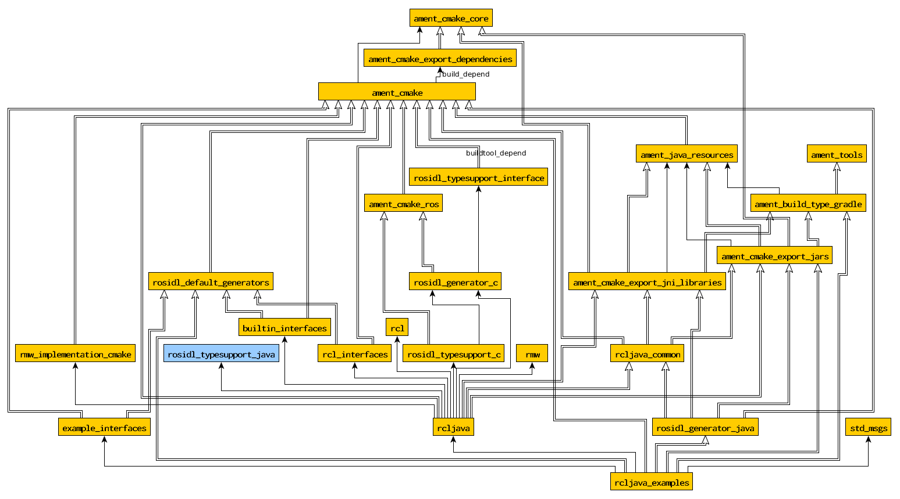

# ada4ros2
Main repository of the ada-ros project. Currently available for linux. A recent GNAT compiler is necessary (debian testing or Ubuntu 17.10+).

This repository is actually a ROS2 workspace. It can be checked out directly and compiled as any other ROS2 overlay:

## Instructions

1. Follow the official instructions to install ROS2. This project has been tested using the "[from source](https://github.com/ros2/ros2/wiki/Linux-Development-Setup)" way.
- Clone this repository with submodules: `$ git clone --recurse-submodules`.
- Enter this repository root folder and issue `$ ament build`
- Source the ./install/local_setup.bash script (or the one right for you).
- Try to run some example nodes: `$ ros2 run rclada_examples listener`. Tab completion should work too.

## Creating Ada nodes

The ada4ros2 project provides two ways of building Ada nodes. One is using the **cmake** build type (since the rest seem to be in a state of flux) and another is using the Ada-only ament_ada [build type](https://github.com/ament/ament_tools/blob/master/doc/development/build_types.rst).

## Using the ROS Client Library binding (rclada).

The library is provided by the rclada node, on which your own node has to depend.

The GPR project file is named `rcl.gpr`, that you have to with on your own project file.

There are two hierarchies of Ada packages in the Ada RCL binding:

1. `RCL.*` packages form the high-level, manually curated binding. It is currently being completed.
-  `RCLx.*` is the automatically generated binding (with `g++ -fdump-ada-spec`). It is not intended for direct use but it should be complete if something is still missing in the high-level binding.

## Extras

Since rclada somewhat follows the ros2_java project structure, I did these dependency graphs on the java_examples package.
This one is simplified removing some common and indirect dependencies, you can see the full one [here](doc/java_example_depends.png).

### Acknowledgements

This project is done with the support of the following entities:

* AdaCore, provider of the open source Ada 2012 compiler [https://www.adacore.com/community]
* The Robotics, Perception and Real-Time group, RoPeRT, [http://robots.unizar.es]
* The Defense University Center of Zaragoza, CUD-Z, [http://cud.unizar.es]

